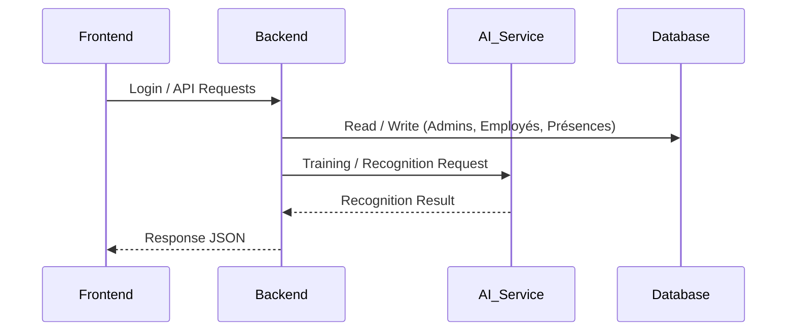
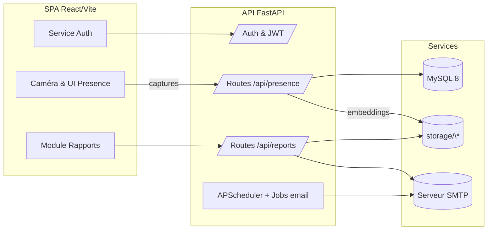
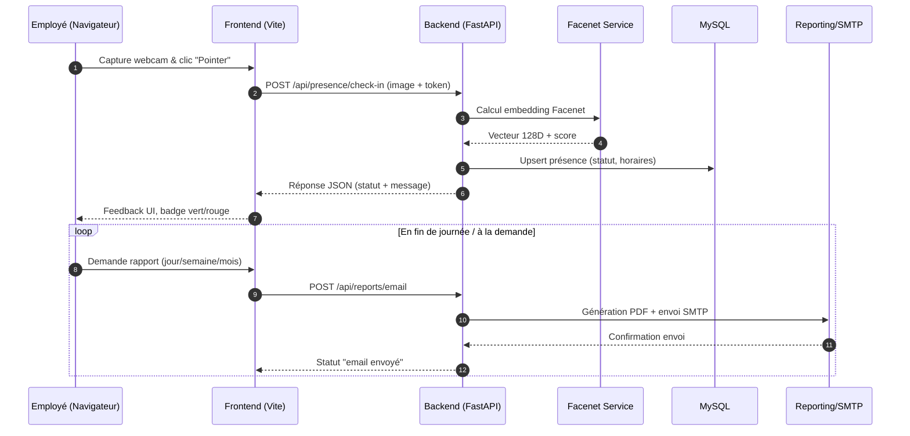

# Face Attendance System

Plateforme de pointage automatique des employés combinant FastAPI, React/Vite et DeepFace (modèle Facenet) pour reconnaître les visages via webcam. Ce document décrit l’architecture complète, la mise en place, les diagrammes UML fournis et la chaîne de traitement Facenet.

---

## FacePresence – Présentation générale du projet

- **Nom du projet** : _FacePresence_
- **Objectif** : proposer une application web de pointage par reconnaissance faciale permettant :
  - l’enregistrement automatisé des entrées et sorties des employés ;
  - la gestion centralisée des employés et des administrateurs ;
  - le pilotage de l’entraînement et de la reconnaissance faciale depuis une interface unique.

---

## Architecture globale (Microservices)

### 🔹 Frontend
- **Stack** : React + Tailwind CSS (Vite).
- **Fonctionnalités clés** :
  - accès à la webcam via `getUserMedia` ;
  - capture d’images puis envoi sécurisé vers le backend ;
  - interface administrateur complète (login, gestion employés, suivi des présences, module d’entraînement facial).

### 🔹 Backend (API principale)
- **Stack** : FastAPI (Python) avec SQLAlchemy.
- **Responsabilités** :
  - authentification administrateur via JWT ;
  - gestion CRUD des employés et des présences (check-in / check-out) ;
  - orchestration des sessions d’entraînement ;
  - communication synchrone avec le service IA pour la détection/reconnaissance.

### 🔹 Service IA (Reconnaissance faciale)
- **Stack** : DeepFace + TensorFlow (CPU) embarquant le modèle Facenet.
- **Rôle** :
  - entraînement et génération des embeddings faciaux ;
  - comparaison en temps réel pour valider les présences ;
  - modèle Facenet et poids déjà inclus dans l’image Docker dédiée.

### 🔹 Base de données
- **Technologie** : PostgreSQL (ciblée pour la version microservices).
- **Contenu** :
  - stockage des administrateurs, employés, présences ;
  - suivi de l’état d’entraînement facial : `has_face_profile`, `face_samples_count`, `last_face_training_at`.

---

## Diagramme UML – Communication des services



Ce diagramme met en évidence la chaîne d’appel principale : le frontend sécurise les demandes des utilisateurs, le backend gère l’authentification et la persistance PostgreSQL, puis délègue la reconnaissance faciale au service IA basé sur DeepFace/Facenet.

---

## Docker & Déploiement

- Utilisation d’images Docker distinctes pour chaque service (frontend, backend, base PostgreSQL, service IA).
- **Images officielles** :
  - Backend : `saidouchrif/facepresence-backend:1.9`
  - Frontend : `saidouchrif/facepresence-backend:1.6`
- **Image backend** :
  - inclut TensorFlow CPU, DeepFace et les poids Facenet pour éviter tout téléchargement runtime ;
  - expose les endpoints FastAPI et les tâches asynchrones liées au training.
- **Service IA** :
  - packagé dans un conteneur dédié afin d’isoler les dépendances lourdes (OpenCV, TensorFlow).
- **Frontend** :
  - build React/Vite servi via un conteneur Node ou Nginx selon l’environnement.
- **Base de données** :
  - PostgreSQL dockerisé avec volume persistant pour les données critiques (admins, employés, présences, états d’entraînement).

Illustrations (placeholders) :


---

## Technologies utilisées

- **Frontend** : React, Vite, Tailwind CSS, getUserMedia.
- **Backend** : FastAPI, Python, SQLAlchemy, JWT.
- **IA** : DeepFace, TensorFlow (CPU), modèle Facenet pré-entraîné.
- **Base de données** : PostgreSQL (avec migration possible depuis MySQL).
- **DevOps** : Docker, Docker Compose, Docker Hub (registry), Render (hébergement/CI possible).

---

## Objectifs du projet

1. Automatiser le pointage des employés via la reconnaissance faciale.
2. Éliminer la fraude ou les pointages manuels non autorisés.
3. Offrir une solution moderne, pilotée par l’IA, simple à déployer.
4. Garantir la scalabilité et la préparation à un passage en production (multi-sites, montée en charge).

---

## Services déployés (Render)

- **Frontend** : https://facepresence-frontend.onrender.com/  
  Interface React/Tailwind accessible publiquement pour la capture webcam, le pointage et l’administration.
- **Backend** : https://facepresence-backend.onrender.com/  
  API FastAPI exposée avec authentification JWT, gestion des présences et passerelle vers le service IA.

---

## 1. Structure du dépôt

```
face-attendance-system-Fill-rouge/
├── backend/                # API FastAPI + logique business
├── frontend/               # SPA React + Vite
├── Diagrammes/
│   ├── Diagramme de classe/      # UML (PlantUML + PNG)
│   ├── Diagramme de use cas/     # Cas d’utilisation
│   └── diagramme de sequince/    # Séquences principales
├── docker-compose.yml      # Orchestration complète (backend, frontend, MySQL, phpMyAdmin)
├── .env.example            # Variables à copier en .env local
└── README.md
```

- **backend/** : FastAPI, SQLAlchemy, DeepFace, endpoints `/api/presence/*`, `/api/reports/*`, `/auth/*`.
- **frontend/** : React Router, tailwind-like styles, pages publiques (`/`, `/entree`, `/sortie`, `/login`) et espace admin (`/dashboard`, `/employees`, `/presences`, `/train-face/:id`, etc.).
- **Diagrammes/** : diagrammes UML exportés + sources `.puml` pour mise à jour rapide.

---

## 2. UML & Documentation visuelle

| Diagramme | Emplacement | Contenu |
|-----------|-------------|---------|
| Diagramme de classes | `Diagrammes/Diagramme de classe/02_class_diagram.puml` (+ `image.png`) | Entités principales (Employe, Presence, FaceTemplate, Admin) + relations DB |
| Diagrammes de séquence | `Diagrammes/diagramme de sequince/` | Scénarios : pointage entrée, pointage sortie, entraînement |
| Diagrammes de cas d’usage | `Diagrammes/Diagramme de use cas/` | Interactions Admin / Employé / Système |

Ouvrez les `.puml` avec PlantUML ou VSCode PlantUML pour régénérer les PNG.

### 2.1 Diagramme de classes – structure des données


- **Employe** ↔ **Presence** : relation 1‑N pour historiser chaque pointage avec le fuseau horaire et le statut (present, late, out_of_hours).
- **FaceTemplate** : stocke le vecteur d’encodage Facenet + chemin du fichier, relié à Employe pour accélérer la comparaison.
- **Admin/User** : acteurs authentifiés qui gèrent les employés, déclenchent l’entraînement et consultent les rapports.
- **Report / EmailJob** (selon migrations) : objets dérivés pour suivre les exports générés et les envois automatiques.

Ce diagramme aligne parfaitement les modèles SQLAlchemy (`backend/app/models/*.py`) avec le schéma MySQL provisionné au démarrage.

### 2.2 Diagrammes de cas d’usage – interactions


Principaux acteurs :
1. **Employé** : peut s’authentifier, pointer entrée/sortie, lancer l’entraînement de son visage sous supervision.
2. **Administrateur RH** : crée des comptes, valide les captures, exporte/partage les rapports quotidiens/hebdo/mensuels.
3. **Système externe (SMTP/MySQL)** : reçoit les demandes d’envoi de mails et stocke les données.

Chaque cas d’usage renvoie vers un écran React correspondant (Login, Presence, TrainFace) et une route FastAPI dédiée (`/api/presence`, `/api/reports`, etc.).

### 2.3 Diagrammes de séquence – flux de bout en bout
Exemples disponibles dans `Diagrammes/diagramme de sequince/` :

- **Pointage d’entrée** (`checkin_sequence.puml`) : capture webcam → upload → calcul Facenet → persist → retour UI (badge vert/rouge).
- **Pointage de sortie** (`checkout_sequence.puml`) : similaire mais déclenche `record_check_out` + email de confirmation optionnel.
- **Entraînement visage** (`training_sequence.puml`) : la SPA capture 20 frames → FastAPI les stocke → pipeline Facenet génère un encodage → MySQL sauvegarde.

Ces séquences servent à expliquer le comportement temps réel aux équipes produit ou aux nouveaux développeurs.

### 2.4 Régénérer ou modifier les diagrammes

1. Installer PlantUML et Java (ou utiliser l’extension VSCode PlantUML).
2. Depuis la racine du repo :
   ```powershell
   java -jar plantuml.jar Diagrammes/**/**/*.puml
   ```
   ou, dans VSCode, ouvrir le `.puml` puis `Alt+D` pour prévisualiser.

Pensez à mettre à jour les diagrammes après toute évolution de modèle (nouvelle table SQL, nouveau flow métier) pour garder la documentation vivante.

---

## 3. Architecture applicative

| Couche | Technologies | Détails |
|--------|--------------|---------|
| **Frontend** | React 18, Vite, Tailwind CSS-like styles | SPA responsive, appelle l’API via `fetch` + bearer token |
| **Backend** | FastAPI, SQLAlchemy, DeepFace (Facenet), Uvicorn | API REST, génération de PDF (ReportLab), envoi e-mail (SMTP) |
| **Reconnaissance faciale** | DeepFace (modèle Facenet) | Embeddings 128D, comparaison cosine ≥ 0.70 |
| **Base de données** | MySQL 8 | Stocke employés, présences, templates faciaux, tokens rafraîchissement |
| **Conteneurisation** | Docker Compose v2 | Services `backend`, `frontend`, `db`, `phpmyadmin` |

### 3.1 Diagramme d’architecture (vue haute)



Cette vue illustre les interactions principales : la SPA collecte les images webcam et appelle FastAPI ; l’API déclenche Facenet/DeepFace pour comparer les embeddings, persiste les présences dans MySQL et archive les rapports dans `storage/`. Les jobs (APScheduler) s’appuient sur les mêmes modules pour envoyer des e-mails planifiés.

### 3.2 Cycle de vie de l’application (séquence)



Ce cycle montre comment un employé traverse l’expérience complète : capture locale, appel API sécurisé, traitement Facenet, persistance MySQL, puis génération/partage des rapports. Les mêmes étapes s’appliquent pour le pointage de sortie (avec la route `check-out`), garantissant un suivi continu du temps de présence.

---

## 4. Pipeline Facenet dans le projet

1. **Capture caméra** (frontend `Entree.jsx` / `Sortie.jsx`) → envoi d’une image `multipart/form-data`.

2. **Traitement API** (`backend/app/api/routes/presence.py`) :
   - Sauvegarde temporaire.
   - Appel `DeepFace.represent(..., model_name="Facenet")`.
   - Chargement des encodages existants (`FaceTemplate.encoding_path`).
   - Similarité cosinus et seuil `0.70`.

3. **Résultat** :
   - Si match : appel `record_check_in` ou `record_check_out` (statut `present/late/out_of_hours`).
   - Si échec : message explicite + score.
4. **Nettoyage** : suppression de l’image temporaire, persistance de la présence et retour JSON (employee info, statut, confiance).

Entraînement des visages : route `POST /api/face/capture-training` depuis `frontend/src/pages/TestFace/TrainFace.jsx`, qui capture 20 frames par employé et alimente `FaceTemplate`.

---

## 5. Variables d’environnement

Copier `.env.example` à la racine en `.env` (non commité) :

```
cp .env.example .env
```

Variables clés :
- `DATABASE_URL` ou `DB_*`
- `SECRET_KEY`, `JWT_SECRET`
- `SMTP_HOST`, `SMTP_USER`, `SMTP_PASS`, `MAIL_FROM_NAME`
- `FRONTEND_URL`, `CORS_ORIGINS`

Dans `docker-compose.yml`, chaque variable possède un fallback (`${VAR:-default}`) pour éviter les plantages sans `.env`.

---

## 6. Installation & exécution

### 6.1. Mode Docker Compose (recommandé)

```powershell
docker compose build
docker compose up --build -d   # (ou sans -d pour logs en direct)
```

Services exposés :
- Backend FastAPI : http://localhost:8000 (Swagger: `/docs`)
- Frontend Vite : http://localhost:5173
- phpMyAdmin : http://localhost:8080
- MySQL : port 3306

Arrêt :
```powershell
docker compose down
```

### 6.2. Mode développeur (hors Docker)

#### Backend
```powershell
cd backend
python -m venv .venv
.venv\Scripts\activate      # PowerShell
pip install -r requirements.txt
uvicorn app.main:app --reload --port 8000
```

Assurez-vous que MySQL tourne, et configurez `DATABASE_URL`.

#### Frontend
```powershell
cd frontend
npm install
npm run dev -- --host --port 5173
```

---

## 7. Points clés du code

- **Authentification** : JWT (access + refresh). `frontend/src/services/authService.js` gère stockage local + refresh.
- **Exports PDF & Email** : routes `api/reports/pdf/*` génèrent PDF (ReportLab) et peuvent être envoyées par e-mail.
- **Composants UI** : `frontend/src/pages/Presence/Presence.jsx` propose export PDF/Excel et envoi e-mail (jour/semaine/mois).
- **Docker** :
  - `backend/Dockerfile`: image Python 3.11, dépendances OpenCV, stockage dans `/app`.
  - `frontend/Dockerfile`: build multi-stage Node 20, Vite dev server exposé sur 5173.
  - `docker-compose.yml`: configure restarts, volumes hot-reload (`backend/app` et `frontend/`).

---

## 8. Ressources supplémentaires

- **Swagger UI** : http://localhost:8000/docs
- **Collection Postman** : à générer via `http://localhost:8000/openapi.json`
- **PlantUML** : ouvrez `.puml` depuis `Diagrammes/**` pour modifier les diagrammes.

---

## 9. Checklist de mise en production

1. Définir toutes les variables sensibles (`SECRET_KEY`, SMTP, DSN).
2. Générer et stocker les modèles faciaux (`/api/face/capture-training`).
3. Configurer HTTPS (proxy Nginx / Traefik).
4. Surveiller l’espace disque (`storage/reports`, `storage/presence_tmp`).
5. Activer les sauvegardes MySQL (`volume mysql_data`).

---

## 10. Support & contribution

1. **Issues / tickets** : ouvrir un ticket GitHub avec étapes de reproduction.
2. **Workflow recommandé** :
   - `git checkout -b feature/...`
   - `npm run lint` / `pytest` (si tests ajoutés)
   - PR → code review.
3. **Contact** : administrateur principal du dépôt GitHub ou via e-mail défini dans `.env`.

Bonne exploration 